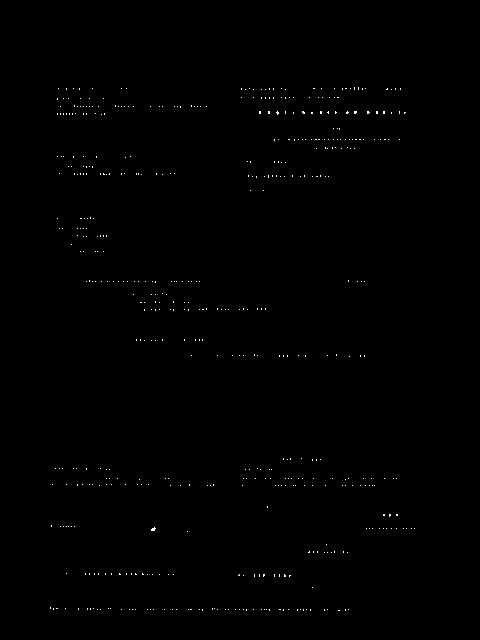
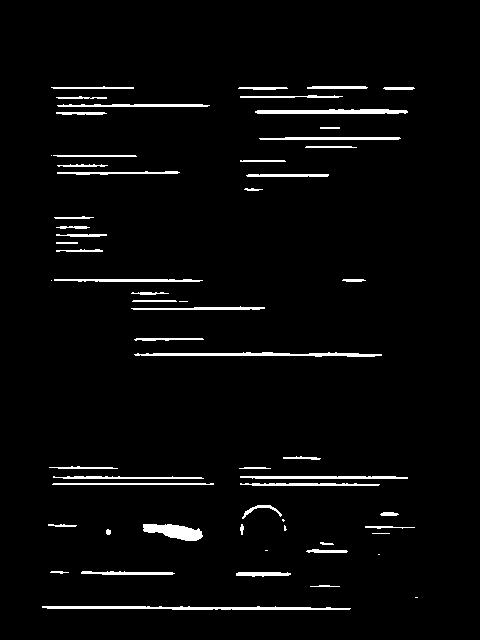
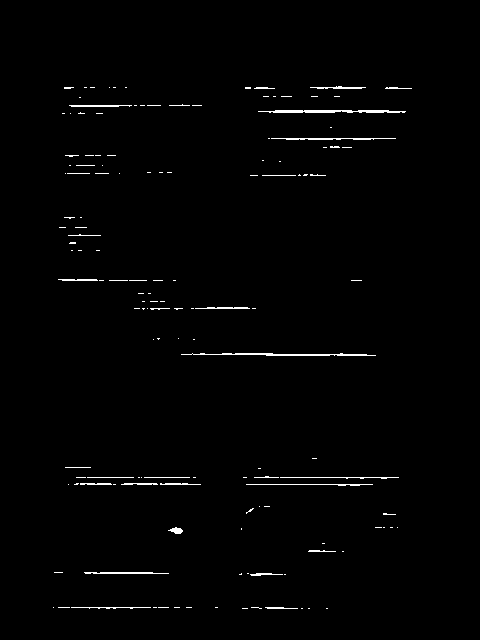
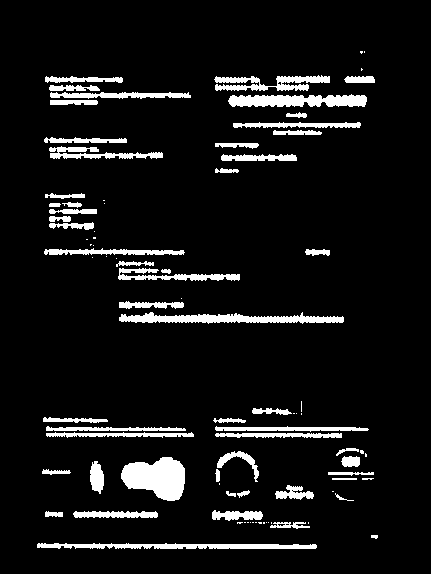
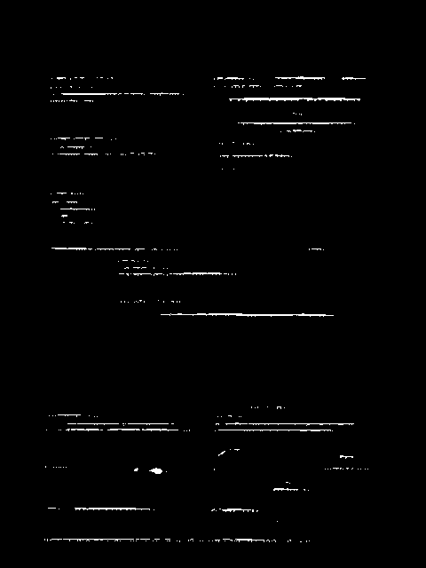

## CRAFT: Character-Region Awareness For Text detection
Official Pytorch implementation of CRAFT text detector | [Paper](https://arxiv.org/abs/1904.01941) | [Pretrained Model](https://drive.google.com/open?id=1Jk4eGD7crsqCCg9C9VjCLkMN3ze8kutZ) | [Supplementary](https://youtu.be/HI8MzpY8KMI)

**[Youngmin Baek](mailto:youngmin.baek@navercorp.com), Bado Lee, Dongyoon Han, Sangdoo Yun, Hwalsuk Lee.**

Clova AI Research, NAVER Corp.

### Sample Results

### Overview
PyTorch implementation for CRAFT text detector that effectively detect text area by exploring each character region and affinity between characters. The bounding box of texts are obtained by simply finding minimum bounding rectangles on binary map after thresholding character region and affinity scores.


## Updates
**13 Jun, 2019**: Initial update
**20 Jul, 2019**: Added post-processing for polygon result
**28 Sep, 2019**: Added the trained model on IC15 and the link refiner


## Getting started
### Install dependencies
#### Requirements
- PyTorch>=0.4.1
- torchvision>=0.2.1
- opencv-python>=3.4.2
- check requiremtns.txt
```
pip install -r requirements.txt
```

### Training
The code for training is not included in this repository, and we cannot release the full training code for IP reason.


### Test instruction using pretrained model
- Download the trained models

 *Model name* | *Used datasets* | *Languages* | *Purpose* | *Model Link* |
 | :--- | :--- | :--- | :--- | :--- |
General | SynthText, IC13, IC17 | Eng + MLT | For general purpose | [Click](https://drive.google.com/open?id=1Jk4eGD7crsqCCg9C9VjCLkMN3ze8kutZ)
IC15 | SynthText, IC15 | Eng | For IC15 only | [Click](https://drive.google.com/open?id=1i2R7UIUqmkUtF0jv_3MXTqmQ_9wuAnLf)
LinkRefiner | CTW1500 | - | Used with the General Model | [Click](https://drive.google.com/open?id=1XSaFwBkOaFOdtk4Ane3DFyJGPRw6v5bO)

* Run with pretrained model
``` (with python 3.7)
python test.py --trained_model=[weightfile] --test_folder=[folder path to test images]

Example:
python test.py --test_folder ./input/ --cuda True --refine
```

The result image and socre maps will be saved to `./result` by default.

### Arguments
* `--trained_model`: pretrained model
* `--text_threshold`: text confidence threshold
* `--low_text`: text low-bound score
* `--link_threshold`: link confidence threshold
* `--cuda`: use cuda for inference (default:True)
* `--canvas_size`: max image size for inference
* `--mag_ratio`: image magnification ratio
* `--poly`: enable polygon type result
* `--show_time`: show processing time
* `--test_folder`: folder path to input images
* `--refine`: use link refiner for sentense-level dataset
* `--refiner_model`: pretrained refiner model

### Parameter tuning guideline
#### CRAFT
Firstly, you need understand how CRAFT works. We feed an image input to CRAFT, then CRAFT will give us two things: character heatmap and link heatmap. Then with *Refine Model*, it takes CRAFT output as input and give us a better link heatmap. Next, we have the character heatmap from CRAFT and link heatmap from Refine Model then we will go to the post-process.

There are three parameters controlling post-process: low_text, link_threshold and text_threshold.
The post-process (PP) firstly do thresholding on character heatmap using low_text parameter and link heatmap using link_threshold.



*Character map low 0.15 and high 0.85*



*Link map low 0.6 and high 0.9*

After that, binary character map and binary link map will be combined into one image.



*Combined map low and high*

Next, the PP uses OpenCV connectedComponentsWithStats() method to find connected blocks. For each block, the PP will check its area size, then check max value of that block pixel (if max_value < text_threshold, the PP will consider that is not a real text block). Then the PP calculates 4 point of the text box.

So that, the meaning of 3 parameters can be explained as following:
* low_text: for separating character and background (the higher the more likely character required)
* link_threshold: for linking characters (the higher the more words/characters separated)
* text_threshold: the minimum required pixel value (in character heatmap) for considering real text box

Currently, toward the bill documents, the nearly best parameters is 0.15, 0.6 and 0.5 corresponding to low_text, link_threshold and text_threshold.

#### Tesseract
OEM modes:
* 0    Legacy engine only.
* 1    Neural nets LSTM engine only.
* 2    Legacy + LSTM engines.
* 3    Default, based on what is available.

Legacy mode does not support Indic and Arabic script language. If we only use mode 1, we can retrain/finetune the tesseract data file.
For the bill document, oem mode 2 scores the best result.

PSM modes:
* 0    Orientation and script detection (OSD) only.
* 1    Automatic page segmentation with OSD.
* 2    Automatic page segmentation, but no OSD, or OCR.
* 3    Fully automatic page segmentation, but no OSD. (Default)
* 4    Assume a single column of text of variable sizes.
* 5    Assume a single uniform block of vertically aligned text.
* 6    Assume a single uniform block of text.
* 7    Treat the image as a single text line.
* 8    Treat the image as a single word.
* 9    Treat the image as a single word in a circle.
* 10   Treat the image as a single character.
* 11   Sparse text. Find as much text as possible in no particular order.
* 12   Sparse text with OSD.
* 13   Raw line. Treat the image as a single text line, bypassing hacks that are Tesseract-specific.

With using CRAFT, we already have text block with correct orientation. So that, we only need psm mode 6.

Before cropping image for Tesseract, we need to enlarge the box a little to make sure that the box covers all strokes of text.

## Links
- WebDemo : https://demo.ocr.clova.ai/
- Repo of recognition : https://github.com/clovaai/deep-text-recognition-benchmark

## Citation
```
@inproceedings{baek2019character,
  title={Character Region Awareness for Text Detection},
  author={Baek, Youngmin and Lee, Bado and Han, Dongyoon and Yun, Sangdoo and Lee, Hwalsuk},
  booktitle={Proceedings of the IEEE Conference on Computer Vision and Pattern Recognition},
  pages={9365--9374},
  year={2019}
}
```

## License
```
Copyright (c) 2019-present NAVER Corp.

Permission is hereby granted, free of charge, to any person obtaining a copy
of this software and associated documentation files (the "Software"), to deal
in the Software without restriction, including without limitation the rights
to use, copy, modify, merge, publish, distribute, sublicense, and/or sell
copies of the Software, and to permit persons to whom the Software is
furnished to do so, subject to the following conditions:

The above copyright notice and this permission notice shall be included in
all copies or substantial portions of the Software.

THE SOFTWARE IS PROVIDED "AS IS", WITHOUT WARRANTY OF ANY KIND, EXPRESS OR
IMPLIED, INCLUDING BUT NOT LIMITED TO THE WARRANTIES OF MERCHANTABILITY,
FITNESS FOR A PARTICULAR PURPOSE AND NONINFRINGEMENT.  IN NO EVENT SHALL THE
AUTHORS OR COPYRIGHT HOLDERS BE LIABLE FOR ANY CLAIM, DAMAGES OR OTHER
LIABILITY, WHETHER IN AN ACTION OF CONTRACT, TORT OR OTHERWISE, ARISING FROM,
OUT OF OR IN CONNECTION WITH THE SOFTWARE OR THE USE OR OTHER DEALINGS IN
THE SOFTWARE.
```
